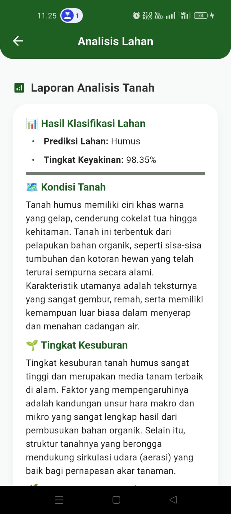

# Petani AI

## Implementasi Metode Convolutional Neural Network (CNN) dengan Arsitektur ResNet-50 pada Aplikasi Mobile untuk Deteksi Penyakit Tanaman Pertanian dan Analisis Kondisi Lahan

---

## Tentang Aplikasi

Petani AI merupakan aplikasi mobile yang dikembangkan sebagai implementasi metode **Convolutional Neural Network (CNN)** dengan arsitektur **ResNet-50** untuk mendeteksi penyakit tanaman pertanian berdasarkan citra daun serta menganalisis kondisi lahan. Aplikasi ini bertujuan membantu pengguna memperoleh informasi secara cepat dan akurat sebagai pendukung pengambilan keputusan dalam pengelolaan tanaman.

---

## Dokumentasi Aplikasi

### 1. Halaman Beranda

Halaman utama aplikasi yang menyediakan akses ke fitur **Deteksi Penyakit Tanaman** dan **Analisis Kondisi Lahan**.

  

---

### 2. Deteksi Penyakit Tanaman

Pengguna dapat mengambil gambar melalui kamera atau memilih gambar dari galeri. Citra daun yang dipilih kemudian diproses menggunakan model **Convolutional Neural Network (CNN)** dengan arsitektur **ResNet-50** untuk mengidentifikasi jenis penyakit tanaman. Setelah proses deteksi selesai, aplikasi menampilkan hasil klasifikasi penyakit tanaman beserta nilai **confidence** sebagai tingkat keyakinan model terhadap hasil prediksi.

  
  &nbsp;&nbsp;&nbsp;&nbsp;
  

---

### 3. Analisis Kondisi Lahan

Pengguna mengisi parameter yang diperlukan untuk melakukan analisis kondisi lahan. Selanjutnya, sistem memproses data yang diberikan dan menampilkan hasil analisis kondisi lahan.

  
  &nbsp;&nbsp;&nbsp;&nbsp;
  

---

## Informasi Penelitian

**Judul Penelitian**

**Implementasi Metode Convolutional Neural Network (CNN) dengan Arsitektur ResNet-50 pada Aplikasi Mobile untuk Deteksi Penyakit Tanaman Pertanian dan Analisis Kondisi Lahan**

**Penulis**

Yosua Marcelinus Sinaga

Program Studi Teknologi Informasi

Universitas Sumatera Utara

---

## Hak Cipta

Repository ini dibuat sebagai dokumentasi kode program penelitian tugas akhir.

Seluruh kode program dan dokumentasi yang terdapat pada repository ini merupakan hak cipta penulis dan digunakan untuk keperluan akademik.

© 2026 Yosua Marcelinus Sinaga
