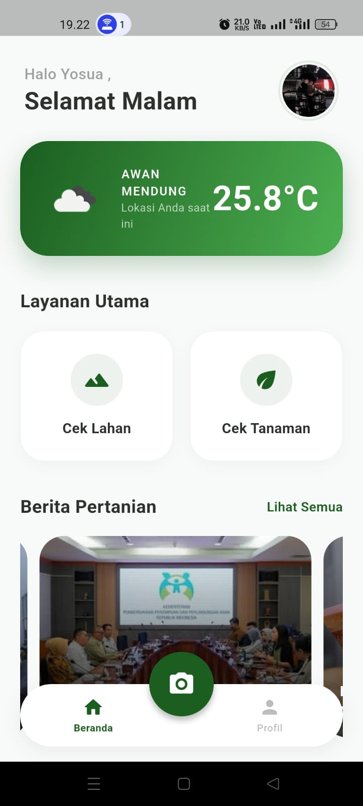
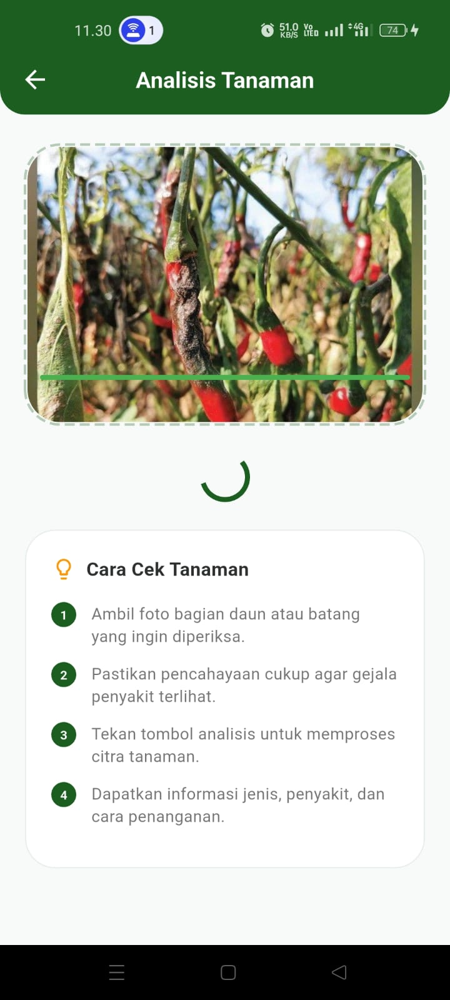
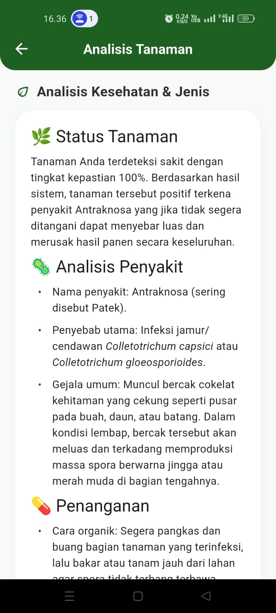
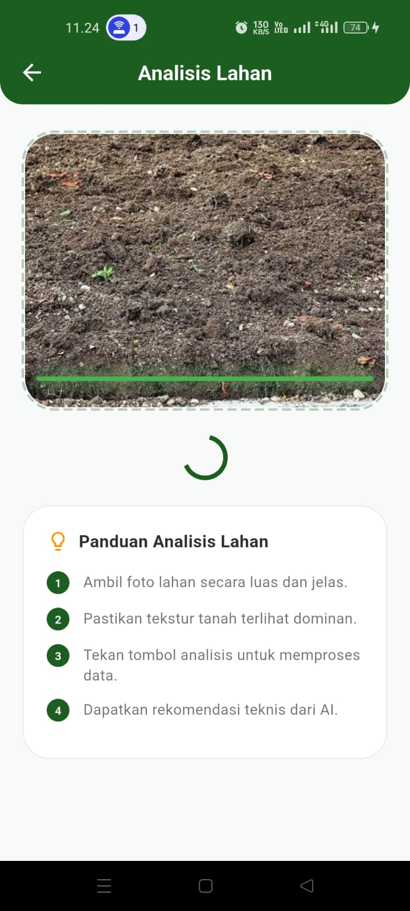

# Petani AI

## Implementasi Metode Convolutional Neural Network (CNN) dengan Arsitektur ResNet-50 pada Aplikasi Mobile untuk Deteksi Penyakit Tanaman Pertanian dan Analisis Kondisi Lahan

---

## Tentang Aplikasi

Petani AI merupakan aplikasi mobile yang dikembangkan sebagai implementasi metode **Convolutional Neural Network (CNN)** dengan **arsitektur ResNet-50** untuk mendeteksi penyakit tanaman pertanian berdasarkan citra daun serta menganalisis kondisi lahan. Aplikasi ini bertujuan membantu pengguna memperoleh informasi secara cepat dan akurat sebagai pendukung dalam pengambilan keputusan pada sektor pertanian.

---

## Dokumentasi Aplikasi

### 1. Halaman Beranda

Halaman utama aplikasi yang menyediakan akses ke fitur deteksi penyakit tanaman dan analisis kondisi lahan.

---

### 2. Halaman Deteksi Penyakit Tanaman

Pengguna dapat mengambil gambar melalui kamera atau memilih gambar dari galeri untuk dilakukan proses deteksi.

---

### 3. Proses Prediksi Menggunakan Model CNN ResNet-50

Citra daun yang dipilih dikirim ke backend untuk diproses menggunakan model **Convolutional Neural Network (CNN)** dengan arsitektur **ResNet-50** hingga menghasilkan prediksi penyakit tanaman.

---

### 4. Hasil Deteksi Penyakit Tanaman

Aplikasi menampilkan hasil klasifikasi penyakit tanaman beserta nilai *confidence* sebagai tingkat keyakinan model terhadap hasil prediksi.

---

### 5. Halaman Analisis Kondisi Lahan

Pengguna mengisi parameter kondisi lahan, kemudian sistem melakukan analisis dan menampilkan hasil sesuai model yang telah dikembangkan.

---

## Informasi Penelitian

**Judul Penelitian**

**Implementasi Metode Convolutional Neural Network (CNN) dengan Arsitektur ResNet-50 pada Aplikasi Mobile untuk Deteksi Penyakit Tanaman Pertanian dan Analisis Kondisi Lahan**

**Penulis**

Yosua Marcelinus Sinaga

Program Studi Teknologi Informasi

Universitas Sumatera Utara

---

## Hak Cipta

Repository ini dibuat sebagai dokumentasi kode program penelitian tugas akhir.

Seluruh kode program dan dokumentasi pada repository ini merupakan hak cipta penulis.

© 2026 Yosua Marcelinus Sinaga
